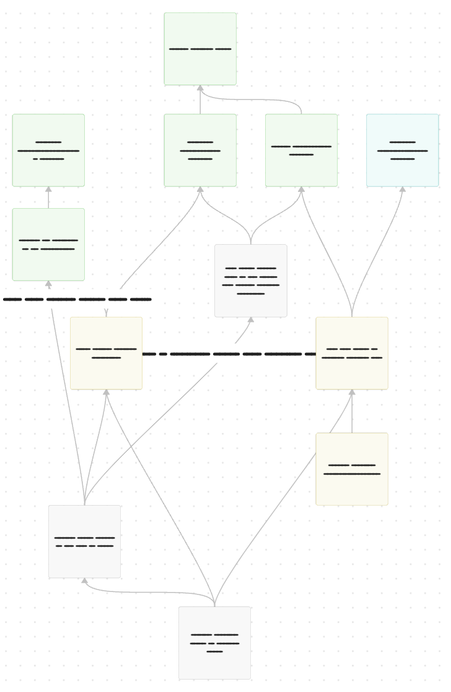
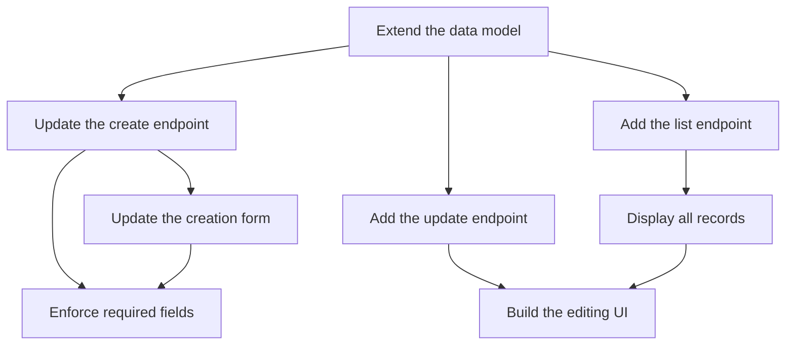
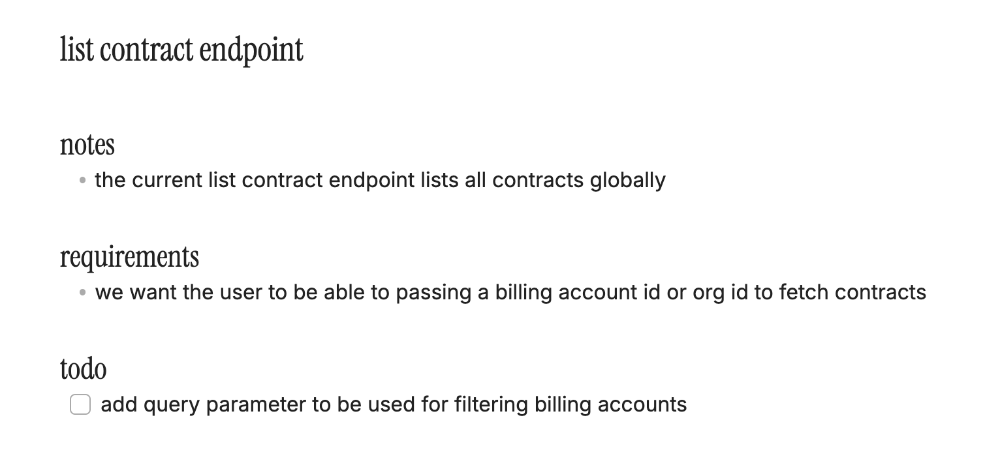
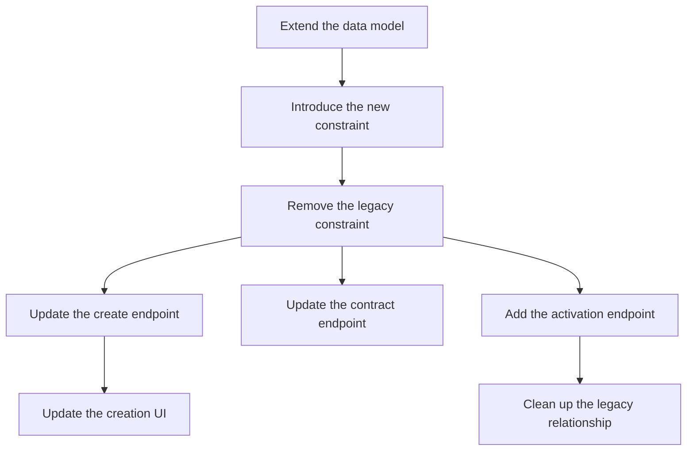

An epic is not simple. It compresses a complex problem—often spanning database changes, APIs, UI work, migrations, validation, cleanup, and deployment constraints—into a single roadmap item.

Tickets break that problem into individual pieces of work. A dependency graph exposes the relationships between those pieces and the order in which they can be completed safely.

That distinction mattered after planning ended. The hard part was tracking what could be done now, recognizing when I had exhausted the available work, and recalculating the plan when a requirement changed.

The dependency graph became a living execution map with three jobs:

1. **Planning:** What depends on what?
2. **Execution:** What is actionable now?
3. **Adaptation:** What changes when a requirement or assumption changes?

A staged rollout made all three jobs concrete.

## Planning: What depends on what?

I started by decomposing the epic into small capabilities. Each capability became a ticket and a node in the graph—for example:

- extend the underlying model;
- update the create endpoint;
- add an endpoint for editing an existing record;
- fetch all records for an organization;
- add the new fields to the creation form;
- display and edit existing records; and
- enforce the new fields as required.

I then connected each node to the work it depended on.

I used color to layer execution status onto the dependency structure. Green nodes were merged, blue nodes were in review, and yellow nodes were in progress. This let the same graph show both the remaining work and my current position within it.

*The dependency graph I used during implementation, with node details redacted.*

The simplified graph below focuses on the dependency paths:

The edges show context that a ticket list cannot. The data model must exist before an endpoint can use its fields. A UI needs an API that accepts its input. A database rule should wait until the active input flow can satisfy it.

The required-fields node depends on the create endpoint accepting the new fields and the creation form collecting them. It does not depend on the update endpoint: editing an existing contract is separate from ensuring that new contracts contain the required data. The graph makes that boundary visible.

### Why this feature required a staged rollout

The desired final state was straightforward: the new fields should be required. The frontend and backend, however, were deployed on different schedules in an application already in use.

If the backend and database enforced the new requirement before the live frontend supplied the fields, requests from that frontend would fail validation at the backend or fail when persisted by the database. Reaching the final state safely therefore required two stages.

#### Stage 1: Introduce the fields without enforcing them

First, I added the fields to the model and allowed the backend to accept them optionally. This preserved compatibility with the existing frontend while the frontend and backend pull requests moved through their independent review and deployment schedules.

The frontend could then add the inputs and require users to provide the necessary values.

#### Stage 2: Enforce the invariant

Once the deployed frontend reliably supplied the required data, the backend could begin validating it and the database could enforce it. At that point, enforcement formalized behavior the active input flow already followed instead of introducing a requirement its callers could not satisfy.

The graph turned that safety condition into an explicit dependency. It showed not only the desired outcome, but also the safe path for reaching it.

## Execution: What is actionable now?

A node became available when its prerequisites were complete. If several nodes became available at once, the graph revealed where work could proceed in parallel.

A blocked node showed which dependency was responsible, what would open after it cleared, and which independent path I could take meanwhile. If an API change was waiting for review, I could choose another available node. If none were available, I knew I had completed everything currently possible and could pause without losing the thread.

A blocker did not just tell me what I could not do. It helped me decide where to work next.

### Keep the reasoning inside the nodes

Each node in my Canvas linked to a working note for that feature. The note contained more than the ticket description. It included:

- requirements and acceptance criteria;
- implementation notes and open questions;
- commands, migrations, and testing concerns;
- decisions and their rationale; and
- a checklist of remaining work.

For example, this feature note kept the endpoint's current behavior, the updated requirement, and the next implementation step together:

*A working note linked from the corresponding node in the dependency graph.*

**The graph became an index into the project, not just a diagram of it.** Jira communicated the current scope to the team, daily notes captured discoveries, and the linked feature notes preserved the reasoning behind each node and edge.

It also reduced the cost of returning to the work. At the start of the next day, I could open the graph and recover what had happened, what remained, and where I could resume without reconstructing the plan from memory.

## Adaptation: What changes when an assumption changes?

My implementation strategy was not designed perfectly in one pass. The first graph represented my initial understanding of the epic. Research, implementation details, and updated requirements changed that understanding.

For example, the workflow evolved so that creating a contract from a billing account page also needed to associate the contract with that billing account. A separate activation capability took on responsibility for updating account state, associating the contract, and emitting an event. That new information changed the API work, the UI flow, the migration order, and the cleanup that would eventually be possible.

I updated the same Canvas to reflect the new plan:

Changing the graph gave me a repeatable way to re-plan:

1. Identify the node whose requirements changed.
2. Update its responsibilities and assumptions.
3. Trace every downstream edge.
4. Revise the affected tickets and notes.
5. Re-evaluate what is blocked and what can begin now.

The graph did not eliminate the cost of changing requirements. It made the reach of the change visible and let me build on decisions that were still valid instead of restarting the planning process.

## A lightweight workflow

My process now looks like this:

1. **Plan:** Decompose the epic into capabilities, link each node to its working context, and draw the dependencies that determine what can begin or deploy safely.
2. **Execute:** Mark progress, choose from the available nodes, and use the graph as the shortest path back into the project when resuming work.
3. **Adapt:** When the plan changes, trace the downstream impact and keep Jira and the linked notes aligned.

The tooling matters less than the habit. A Canvas, whiteboard, or text-based graph can all work. The useful part is maintaining a visible model of the dependencies instead of holding them all in memory.

## A wider field of view

The closest analogy I can think of is the Byakugan: the graph gave me a wide view of the work around me, but it still had blind spots.

It could show the dependencies and requirements I already knew about, but it could not reveal assumptions I had not questioned, business intent I had not yet discovered, or requirements that had not surfaced. Those still had to come from research, implementation, and conversations with people who understood the domain.

Within that boundary, the graph gave me a reliable view of where I was, what I could work on next, and how a newly discovered requirement changed the plan.

Most importantly, the graph remained useful after planning ended. It became a living tool for execution, staged rollout, communication, and adaptation.

An epic tells you where you want to go. A dependency graph shows you what can move now, what must wait, and how to redraw the route when the destination changes.
