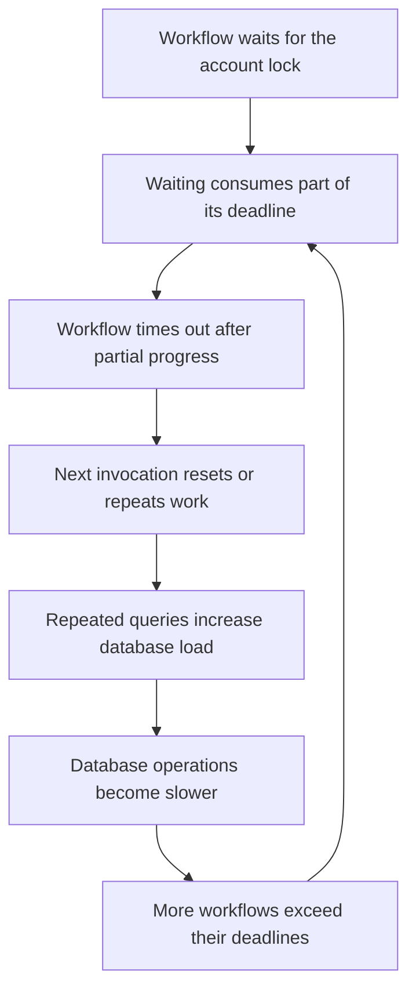
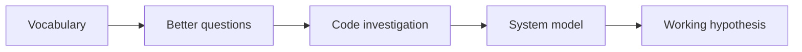

During my internship, I helped investigate a billing workflow that had stopped making reliable progress.

The database was busy. Workflows were piling up. Throughput was low. The system was doing a lot of work, but very little of that work appeared to be finishing.

At first, the mutex looked like the obvious problem. Workflows needed to acquire a lock for a billing account before performing certain operations, and the incident report identified that lock as the direct bottleneck behind the queue. But a mutex by itself did not explain the rest of what I was seeing.

It did not explain why database usage kept climbing. It did not explain why throughput stayed low. It did not explain why scaling the database from 4x to 12x did not restore the system.

## Finding a starting point in systems fundamentals

What helped me investigate was not prior experience with that workflow engine. It was the vocabulary I had built in CS 143A, my operating systems course.

Words like **mutex**, **scheduling**, **fairness**, **starvation**, **preemption**, **deadlock**, and **forward progress** gave me a way to ask better questions. Those questions moved the investigation from the visible bottleneck to a larger pattern: queueing, deadlines, partial progress, and recovery behavior may have been interacting in a way that amplified failure.

I want to be careful about scope. I did not establish the root cause of the incident, and I never received a definitive answer about the original trigger. What I developed was a working hypothesis for how an initial slowdown or timeout could grow into a degraded state. My contribution was to trace the relevant workflow behavior, connect it to systems concepts, and identify mechanisms worth investigating further.

## High utilization is not high throughput

The symptoms looked contradictory at first:

- Database usage was high and continued to rise.
- Workflow throughput was low.
- Charging and finalization workflows were no longer making reliable progress.
- Work accumulated behind an account-level mutex.
- Increasing database capacity did not restore throughput.

The database scaling initially looked promising because it gave the system more room to operate. But the workload steadily consumed the additional capacity. We had increased how much work the system could attempt at once, not necessarily how much useful work it could finish.

That distinction became central to the investigation:

> **High utilization is not the same as high throughput.**

A system can be extremely busy while repeatedly performing work that is later discarded, reset, or attempted again. In that state, adding capacity can give the failure mode more room to expand.

## The mutex was only the beginning

The mutex existed for a good reason. Some operations on the same billing account could not safely run in parallel, so a workflow acquired an account-level lock before entering that part of the workflow.

Seeing a mutex immediately brought me back to operating systems. I started asking questions that sounded like they came straight out of class:

- Who currently owns the resource?
- What does fairness mean in this queue?
- What happens when a workflow holds the mutex too long?
- Does losing the lock stop the workflow, or can it keep running?
- Can a workflow starve even if the queue is moving?
- What state is left behind when work is interrupted?

Those questions did not produce an answer by themselves. They gave me a map for reading unfamiliar code.

I learned that lock requests were queued and that the mutex had an aging mechanism for waiters. **Aging** is a scheduling technique that increases priority the longer work waits, reducing the chance that newer work continually jumps ahead of older work. That gave the mutex a form of fairness and supported forward progress through the queue.

**Queue fairness and workflow completion are different guarantees.**

A waiting workflow could eventually acquire the lock and still have too little time left to finish its work. The queue could be fair while the overall workflow system still failed to make durable progress.

## The lock and the workflow had different lifetimes

The lock and the workflow ran on different clocks:

| Lifetime | Limit | What happened when it ended |
| --- | --- | --- |
| Account-level lock | One hour | Another waiter could acquire the lock. |
| Workflow | Three hours | The workflow timed out, potentially leaving partial work behind. |

I initially connected the lock timeout to **preemption** from operating systems. But there was a crucial difference:

- **Preemption:** the scheduler pauses a process so another can use the CPU.
- **Lease expiration:** the right to hold a resource expires, but the old holder may keep running.

> **Losing permission to continue is not the same as being stopped.**

Here, another workflow could acquire the expired lock while the previous holder continued executing. To protect the resource, the old holder needed to stop using it, or the resource needed to reject its operations.

This mismatch was a lead, not proof of the cause. A senior developer explained that the configuration had worked for a long time and that the three-hour deadline was a generous buffer, not a calculated execution budget.

## Waiting consumed the deadline

The next detail changed how I understood the failure mode: the three-hour workflow deadline started when the workflow started, not when it acquired the lock.

> Time spent waiting in the mutex queue consumed part of the workflow's execution budget.

If a workflow waited for one hour, it did not receive three fresh hours to complete its work. It had roughly two hours left.

That became the beginning of the possible snowball effect:

1. More contention meant longer waits.
2. Longer waits left less time to complete work after acquiring the lock.
3. Less execution time made a timeout after partial work more likely.

This mattered during large backfills. A full-month finalization could process as many as 720 hours of usage, with activity calls performed for each hour. Even a small average cost per hour adds up quickly. At 15 seconds per hourly unit, 720 units take three hours before accounting for queueing, database slowdown, retries, variability, or overhead.

The system combined several reasonable-looking clocks into one risky budget:

```text
workflow deadline
    = time waiting for the mutex
    + time performing the backfill
    + time lost to slower database operations
```

Under normal conditions, the workflow might complete. Under contention, queueing left less time for execution. Under database load, each unit of work took longer. A workflow that normally fit inside its deadline could cross that deadline in a degraded state.

## A timeout was not a rollback

The three-hour timeout ended the workflow, but it did not behave like rolling back a database transaction. The workflow could leave partial progress behind.

That created a recovery question:

| Existing work | Recovery behavior |
| --- | --- |
| Wrong | Replace it and run again. |
| Correct but incomplete | Resume from a checkpoint. |

Those two cases require different behavior. Treating them the same can turn recovery into repetition.

From my reading of the code, the recovery path appeared not to distinguish cleanly enough between incorrect completed work and correct incomplete work. A later invocation could reset or repeat work that a previous invocation had already performed. Although there was no explicit retry policy on the workflow itself, the surrounding trigger and reset behavior could still create something that looked like a retry loop.

This did not look like a classic deadlock. The workflows were not necessarily stuck forever in a cycle of waiting. The system was active. It was busy. But it struggled to make durable forward progress.

The pattern looked closer to livelock or a retry storm: lots of motion, little completion.

## The failure-amplification loop

Once I connected timeouts to partial work and reset behavior, the high database usage and low throughput no longer seemed contradictory. They could be two outcomes of the same feedback loop.



This is the core idea I took away from the investigation:

> A system can fail not only because one component is slow, but because the recovery behavior creates more work for the slow component.

One missed deadline can create recovery work. Recovery work increases load on a shared dependency. The dependency gets slower. More workflows miss their deadlines. The loop sustains itself.

That also explains why scaling the database did not necessarily solve the issue. More capacity raised the ceiling, but it did not change the queueing behavior, the workflow deadline, the lock lifetime, or the interpretation of partial work. If the system was repeating work, it could expand into the new headroom while throughput remained low.

## What systems fundamentals gave me

CS 143A did not hand me a ready-made answer. A durable distributed workflow is not the same thing as a set of processes scheduled by one operating system.

What the course gave me was a vocabulary for learning an unfamiliar system.

- **Mutex:** ownership and mutual exclusion.
- **Scheduling:** where fairness existed and whether waiters used aging.
- **Preemption:** losing lock ownership versus actually stopping execution.
- **Timeouts:** how the system's different clocks compared.
- **Fault tolerance:** what happened to partial progress.
- **Re-entrancy and idempotency:** whether running something again was actually safe.

The concepts formed a chain:



That was the valuable part. Systems fundamentals gave me a way to reason about software I had never seen before. They helped me move from naming the visible bottleneck to understanding the protocol around it.

## Lessons I took away

1. **A mutex is rarely the whole explanation.** It is part of a protocol involving ownership, waiting, expiration, and recovery. To understand a lock-related incident, I need to examine that entire protocol.

2. **Timeout values cannot be evaluated independently.** A three-hour workflow timeout may sound generous until one hour can be spent waiting and the remaining work can itself require close to three hours.

3. **Retrying is only safe when work is designed to be retried.** Idempotency, checkpointing, and the interpretation of partial state determine whether a new invocation is recovery or repetition.

4. **Database utilization does not measure useful progress.** If the system is repeating discarded work, higher database usage can coexist with lower throughput.

5. **Scaling cannot repair a feedback loop by itself.** More capacity can buy time, but if failures create more load, the system may eventually consume the new headroom too. The durable fix has to reduce amplification: preserve checkpoints, distinguish incomplete work from invalid work, align deadlines with worst-case execution time, and ensure expired lock holders cannot continue modifying protected state unchecked.

## Conclusion

I did not leave the investigation knowing the root cause. I left knowing how to ask better questions.

The mutex stopped being merely "the bottleneck" and became part of a larger protocol involving ownership, scheduling, deadlines, partial progress, and recovery. That shift is what operating systems fundamentals gave me.

They helped me see how a system could do more and more work while accomplishing less and less.
