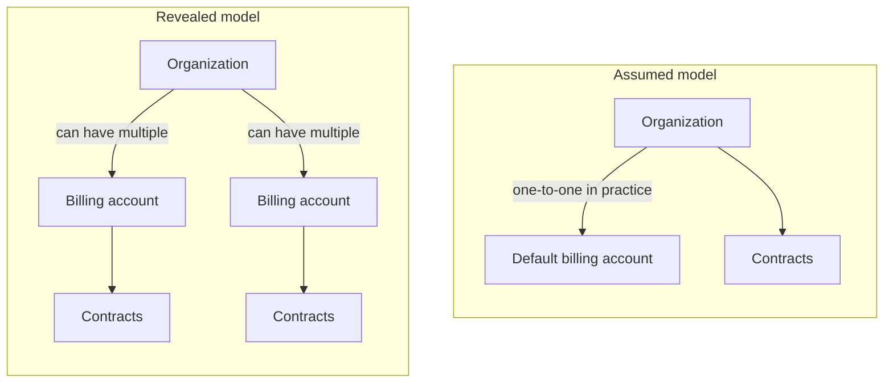

I used Rovo to search through Confluence because I wanted context that reading code alone could not give me: how the system was designed, why decisions had been made, and what history might explain the implementation.

Code gave me another view. It showed me how things actually worked in the implementation. With AI helping me work through both sources, I felt confident enough to make design decisions.

> I had built a coherent explanation of the system. I mistook that coherence for completeness.

The confidence was the dangerous part. I stopped asking questions because I thought I had already found the places where the answers lived.

## Current state is not an invariant

One assumption involved organizations and billing accounts. The implementation and the data I had seen represented them as one-to-one, but I had never established whether that was a requirement or simply how the system was currently used.

### The assumption

Contracts belonged to billing accounts, but I placed the contract listing on the organization page. Every organization I had seen effectively had one billing account, so the two concepts felt interchangeable. A contract also intuitively felt like something a company or organization would own. Nothing in the implementation I had seen forced me to confront the distinction.

### What the review exposed

A question in PR review led to a chain of questions, and the assumption started to unravel. The PR added a composite uniqueness constraint on `contract_id` and `billing_account_id`. It made me question whether my implementation reflected the correct domain model rather than merely choosing between plausible ways to fetch and display contracts.

Those are different claims:

- **Current state:** the implementation and observed data represented organizations as having one billing account.
- **Invariant:** an organization must never have more than one billing account.

I had treated the first as proof of the second. The default account made multiple accounts possible in the model, but I had not carried that possibility into the design.

Once I considered the organization-owned model alongside multiple billing accounts, the design became awkward. To retrieve all of an organization's contracts, I would have to fetch every associated billing account and then retrieve the contracts from each one. That felt too complicated for a simple ownership relationship. The complexity became a clue that I was modeling the domain incorrectly.

### The design correction

The PM clarified the product behavior: contracts belonged in the billing-account context, not the organization context. The default account and organization had looked interchangeable only because the data I had seen happened to make them so. Moving the feature to the billing-account page removed the need to compensate for the wrong ownership model.

That was a model shift for me. The billing-account example taught me that current state is not necessarily an invariant.

## A column name did not tell the whole story

A second example involved a generic `name` column. Through a conversation with the PM, I learned that it was being used to hold three different kinds of information.

The field's name suggested a simpler meaning than it had in practice. What initially looked like a straightforward rename was actually a modeling problem. Renaming `name` to one of its meanings would make the schema more precise for one use while making the other uses less accurate. Understanding how the field was used changed the work from a rename into separating concepts that had been collapsed together.

By then, I was already questioning whether documentation and code were enough. Talking with the PM exposed another gap: how people had learned to use the system.

> A codebase is only one representation of a system. The actual system includes business processes, historical decisions, workarounds, migrations, and ways people have learned to use it.

The PM's domain knowledge was a missing layer in my understanding. It helped explain what the data represented to the people using it. The name-column example taught me that implementation structure is not necessarily domain meaning.

## Use AI to keep asking questions

Documentation, code, and AI were useful. My mistake was treating the understanding they gave me as complete enough to stop checking my assumptions.

Going forward, I want to keep the PM more involved while I am forming the design. Before an assumption becomes a page, a query, or a data model, I want to ask:

- Is this a real constraint, or just what happens to be true today?
- Which entity owns this behavior, and why does it belong there?
- What does this data mean to the people using the system?

I still want AI to help me search documentation and trace code. The difference is that I no longer want it to give me the confidence to stop asking questions. I want it to help me find the assumptions worth questioning.

Knowing how to build something gave me confidence. Knowing whether I was building the right thing required understanding what the code could not tell me.
